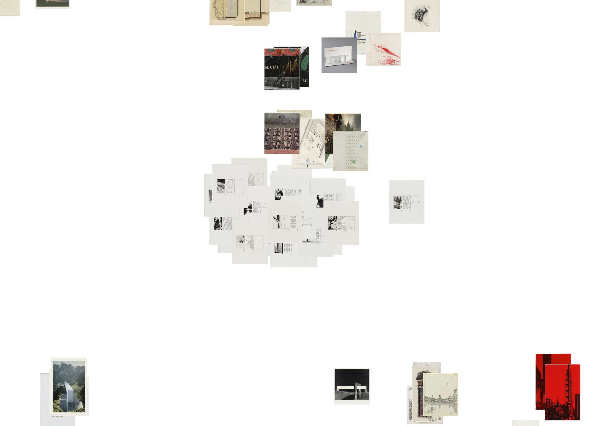

# t-SNE-ImagePlots
Nonlinear dimensionality reduction as sematic basis of data visualizations

Similarity visualizations are an increasingly central element of data exploration in digital humanities and cultural heritage research. This makes it important to understand what such meta images of big image data show, what they hide, and what they make believe. In order to investigate those rather new visualization techniques diagrammatically, a mathematical understanding, a technical experimentation, a theoretical analysis as well as a historical contextualization is needed.

